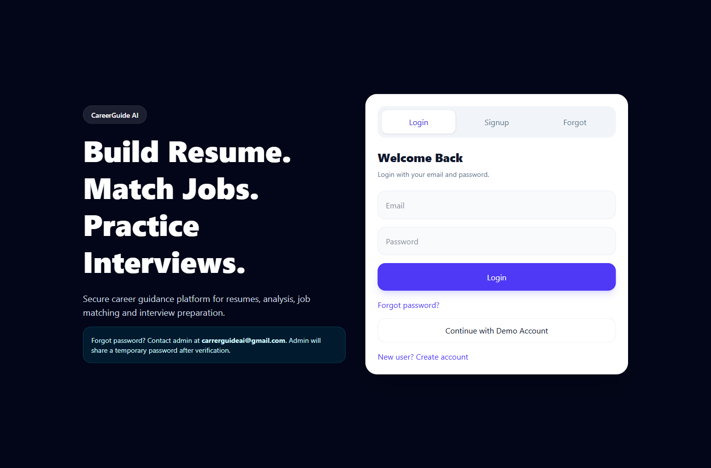
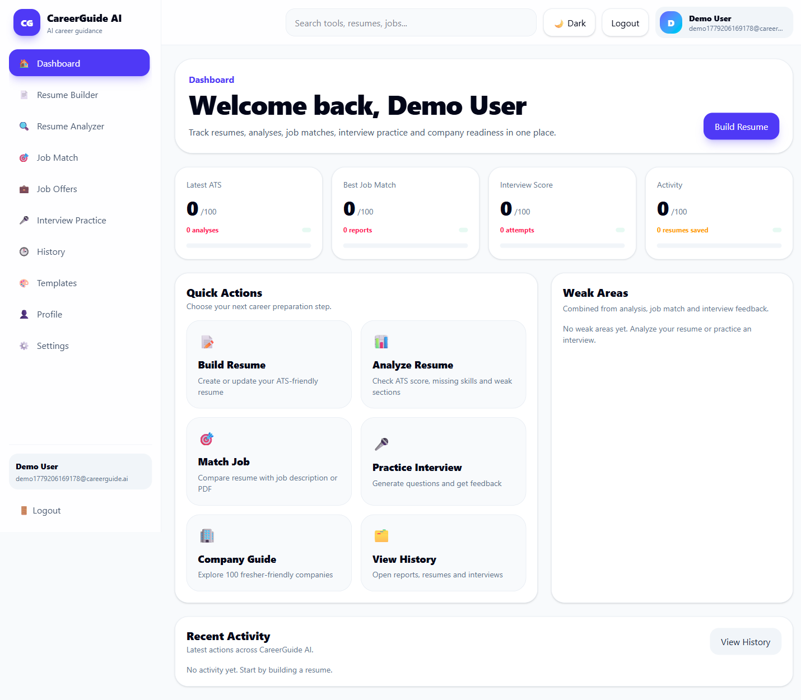
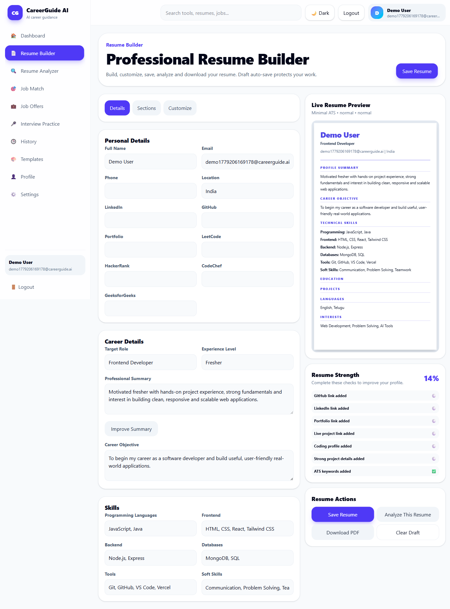
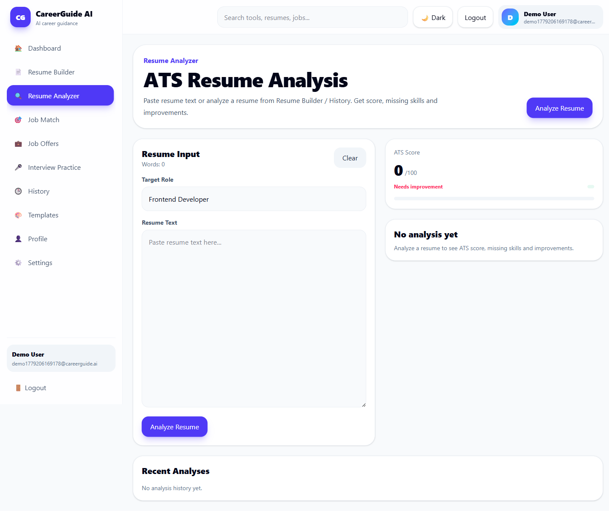
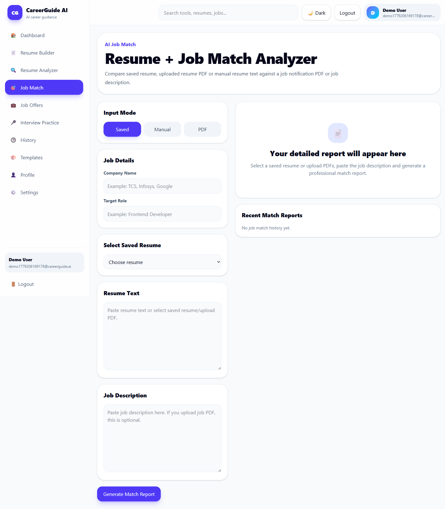
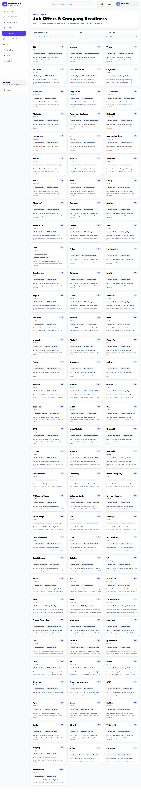
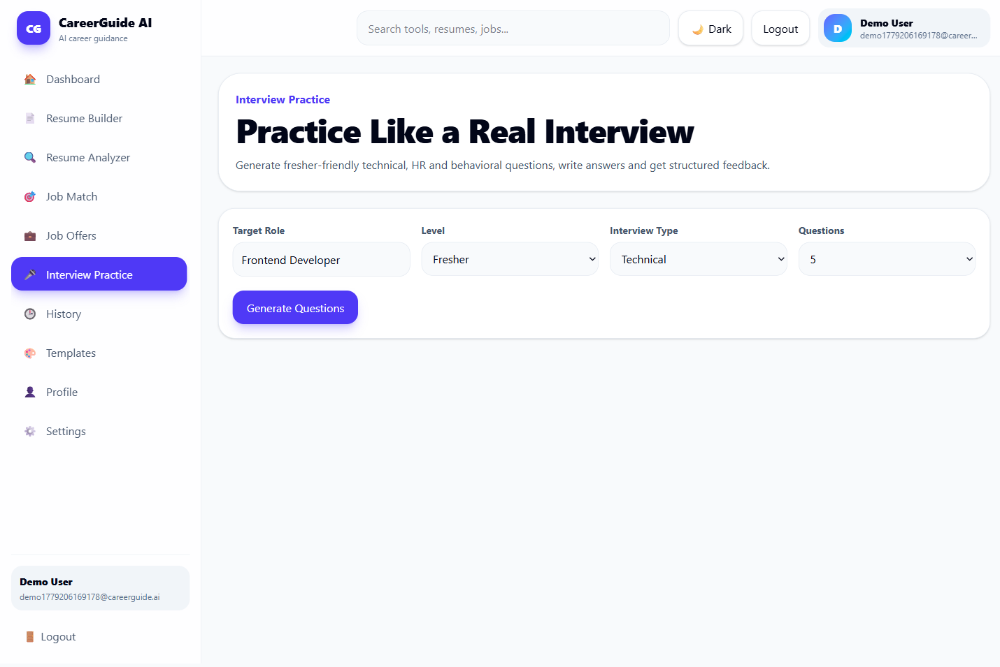
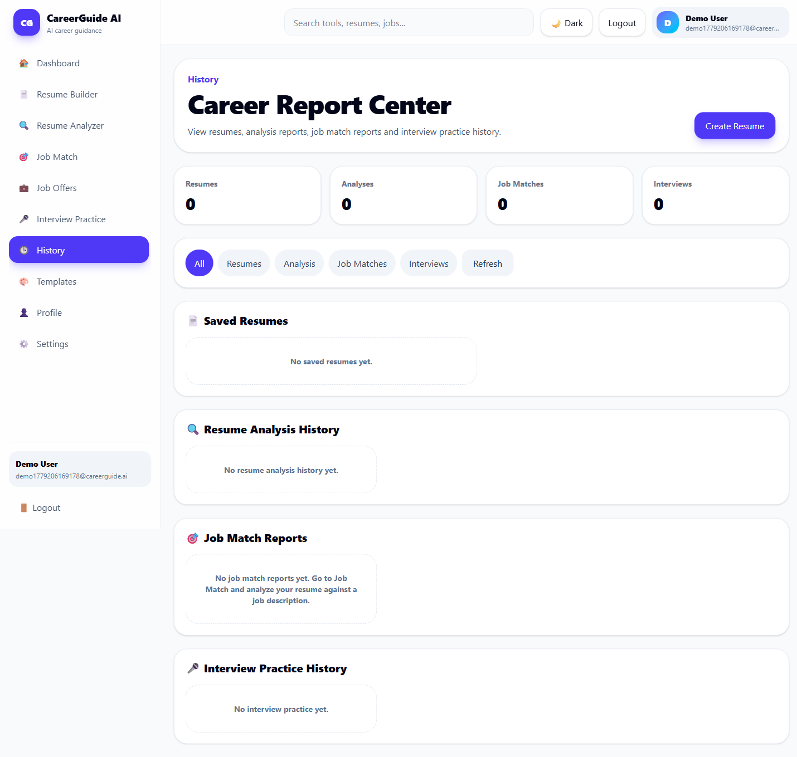

# CareerGuide AI

CareerGuide AI is a full-stack career guidance platform for freshers. It helps users build professional resumes, analyze resume quality, match resumes with job descriptions and job notification PDFs, prepare for interviews, explore major companies, and track progress.

## Live Demo

Frontend: https://careerguide-ai-one.vercel.app/  
Backend Health: https://careerguide-ai-7s24.onrender.com/api/health

## Key Features

- Secure direct signup and login
- Contact-admin forgot password flow with temporary password support
- Forced change-password flow after temporary password login
- Dashboard analytics and quick actions
- Professional resume builder with templates, preview, strength score, customization, save/edit/download/analyze
- Resume Analyzer with ATS score, skills found, missing skills, weak sections and suggestions
- Job Match Analyzer with manual text and PDF upload support
- Resume PDF + Job Notification PDF comparison
- Detailed job match report with shortlist chance, matched skills, missing skills, improvements, questions and roadmap
- 100-company fresher-focused company directory
- Company readiness checker
- Interview practice with feedback and history
- History center for resumes, analyses, job matches and interviews
- Light mode by default

## Tech Stack

Frontend: React, Vite, Tailwind CSS  
Backend: Node.js, Express.js, MongoDB Atlas, Mongoose  
Authentication: JWT, bcryptjs  
PDF: multer, pdf-parse  
Deployment: Vercel frontend, Render backend

## Local Setup

### Backend

```bash
cd server
npm install
npm run dev
```

Expected:

```txt
Server running on port 5000
MongoDB connected
```

### Frontend

```bash
npm install
npm run dev
```

Open:

```txt
http://localhost:5173/
```

## Environment Variables

Create `server/.env` locally:

```env
MONGO_URI=your_mongodb_atlas_connection_string
JWT_SECRET=your_jwt_secret
ADMIN_SECRET=careerguide_admin_2026
PORT=5000
OTP_EXPIRES_MINUTES=1440
```

For Vercel frontend:

```env
VITE_API_URL=https://careerguide-ai-7s24.onrender.com/api
```

## Admin Forgot Password Flow

The platform currently uses a contact-admin reset flow to avoid domain/email-delivery dependency.

1. User clicks Forgot Password.
2. User contacts admin at `carrerguideai@gmail.com` with registered email.
3. Admin sets a temporary password using the protected admin API.
4. User logs in with temporary password.
5. User is forced to create a new password.

## Project Screenshots

### Login / Signup


### Dashboard


### Resume Builder


### Resume Analyzer


### Job Match


### Company Directory


### Interview Practice


### History

## API Route Overview

- `POST /api/auth/signup`
- `POST /api/auth/login`
- `POST /api/auth/change-password`
- `GET /api/auth/admin/reset-requests`
- `POST /api/auth/admin/set-temp-password`
- `GET /api/dashboard/stats`
- `POST /api/resumes`
- `GET /api/resumes`
- `PUT /api/resumes/:id`
- `DELETE /api/resumes/:id`
- `POST /api/analysis`
- `GET /api/analysis`
- `POST /api/job-match`
- `POST /api/job-match/pdf`
- `GET /api/job-match`
- `POST /api/interviews/start`
- `POST /api/interviews/answer`
- `GET /api/interviews`
- `POST /api/job-offers/company-readiness`

## Future Improvements

- Verified domain email reset flow
- Real AI-based resume rewriting
- Admin dashboard UI
- Resume versioning
- Company-wise live openings integration
- More resume templates

## Author

Built by Anudeep as a fresher-focused full-stack career guidance platform.

